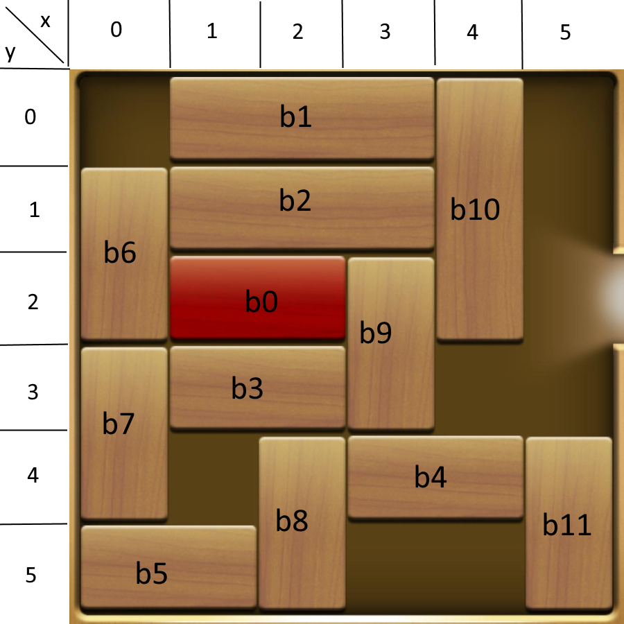

# BlockMover

Horizontal blocks can only move to the left or right

Vertical blocks can only move up or down

"-" 👉 move ⬅️ / move ⬆️

"+" 👉 move ➡️ / move ⬇️

exemple with this image

b6- : ⬆️

b11--- : ⬆️⬆️⬆️

Solution for this exemple:

b6- b0- b11--- b4+ b9++ b3+++ b8- b9- b5++++ b7+ b8+ b9+ b3---- b8-- b9-- b4--- b5-- b9+ b10+++ b1++ b11++ b2++ b8-- b0++++
